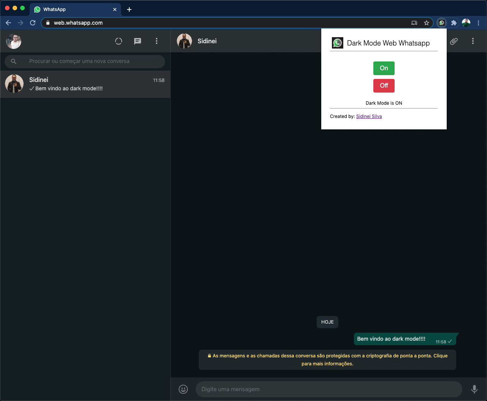
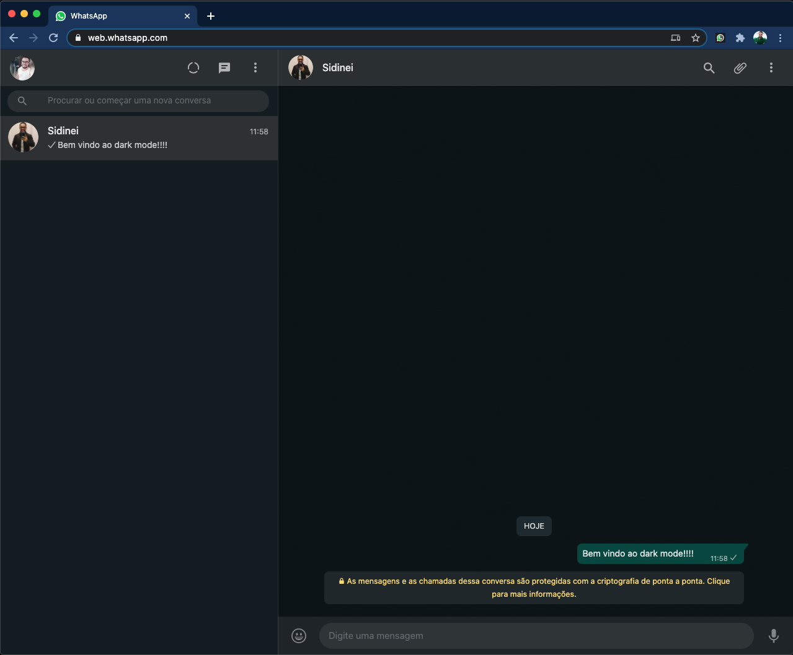
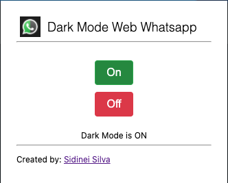

# Dark Mode Web Whatsapp Extension

Está extensão permite que habilite e desabilite modo dark do whatsapp.

## Instalação

Até o momento a extensão esta em revisão pela equipe do google chrome, assim que estiver disponivel postarei o link de instalação.

## Video Usage

Vídeo de utilização da extensão.

## Screenshots

Página com extensão ativada 

Página com dark mode habilitado

Página com dark mode habilitado

